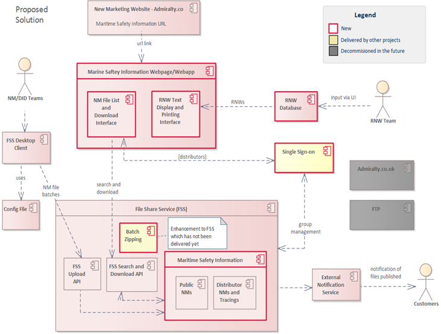

# Maritime Safety Information

## The Business Requirement

The UKHO have embarked on a project to create a new Admiralty Customer portal that separates Admiralty Products from our hydrographic duties (including SOLAS).

Marine Safety Information (Notice to Mariners and Radio Navigation Warnings) are no longer part of this new portal, but unfortunately the underlying SharePoint service is no longer supported. Therefore, a new service will be required to ensure our customers can still download the necessary NMs created each week and review new RNWs.

Both the NM Web Search and the Notice to Mariners Web pages offer the public and our distributors the ability to retrieve the latest changes to our (UKHO) products. However, the mechanisms they use to achieve this are entirely separate. Therefore, a new service will be required to ensure our customers can still download the necessary NMs created each week without having to use the NM Web Search portal.

The removal of SharePoint and the web service will also affect RNWs, this will also require a new portal for customers to review RNWs and print if required as well as a new data store to store the information.

One new Portal would be suitable to store all the pages required by both the NM and RNW services.

This new Portal will access two internal storage systems, use Single Sign-on for registered Customers, and will be accessible to the general public without having to log in.

## The Technical Requirement

* FSS will be store NMs (and tracings) for both public and distributor needs.
* Existing FSS Desktop Client will be used by internal team to upload NMs to FSS with the aid of a config file.
* Website built in ASP.NET MVC.
* Website will list available NMs and provide download functionality from FSS via current FSS APIs.
* Batch Zipping functionality will be provided as part of FSS enhancements.
* SSO group management will be provided as part of SSO/FSS enhancements
* Website will present RNWs for viewing and printing which will be fed from a database (proposed SQL Server).  This will only support the text required for the website.
* External Notification Service used to notify distributors that NMs have been published to the FSS.

## Architecture principle alignment

* We will put user needs first
* We will be open
* We will be cloud first (proposed Azure)

## The Architectural Vision

The NMs and RNW solution will be hosted in the cloud (likely Azure as this is the location of FSS). The NMs and Tracings on FTP will be migrated to FSS. Using FSS to store the NMs and Tracings for this website will therefore remove some duplication of storing NMs and Tracings in two locations as is done in the legacy process.

* Re-uses the FSS and its APIs, leveraging the tool sets already available for upload via config files.
* Allows for External Notification events to be published, either initially or as a future enhancement (requiring only minor config-style changes to CRM and External Notification Service).
* RNW DB - will only be developed to store the text required for the website.

